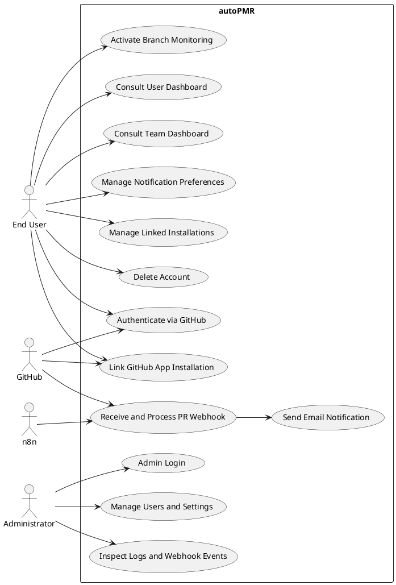
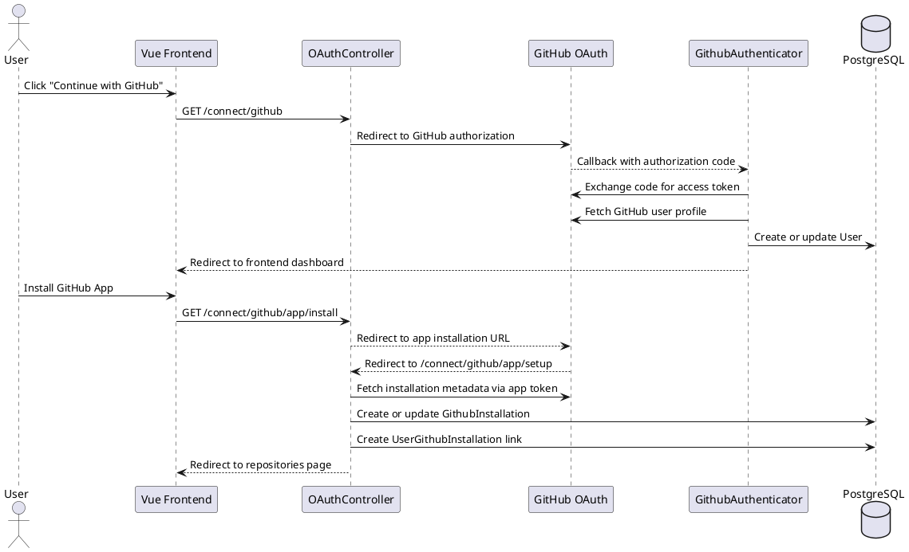
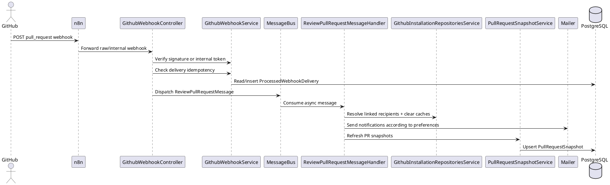
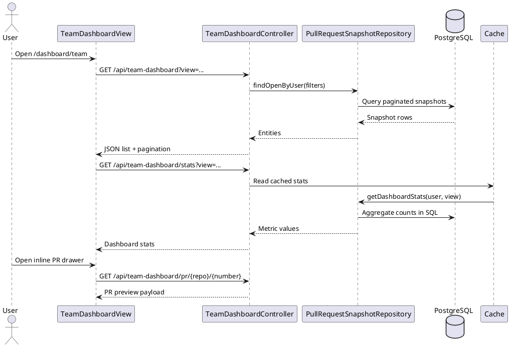
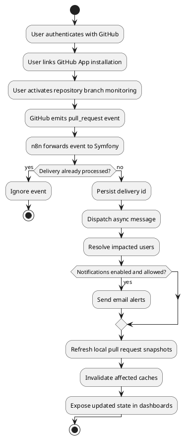
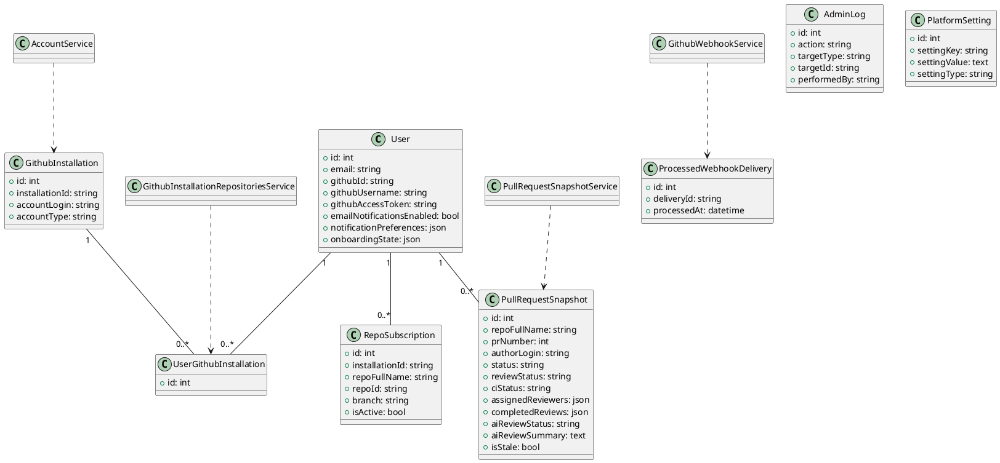
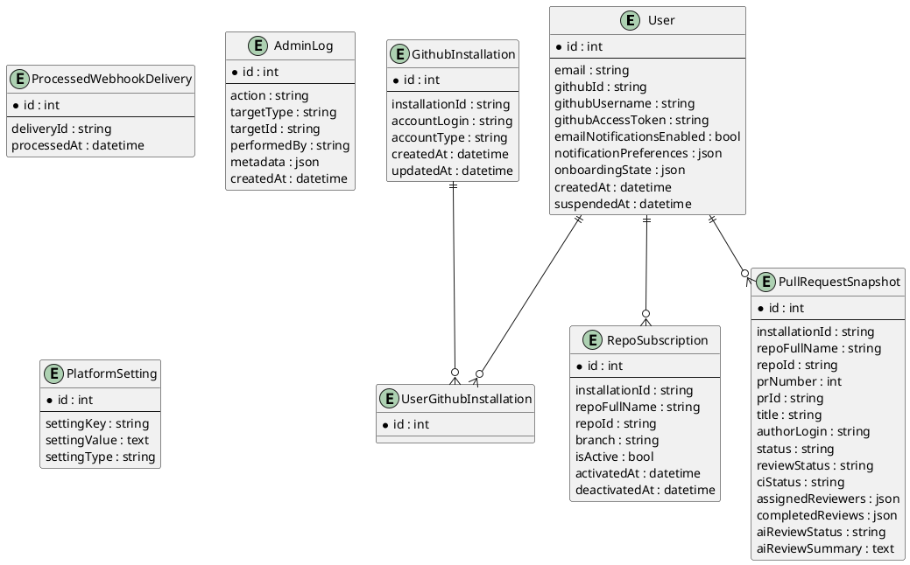

# PFE Documentation - autoPMR

## 1. Introduction

This document presents a complete academic analysis of the `autoPMR` project based exclusively on the inspected source code, configuration files, migrations, and frontend/backend structure available in the repository.

`autoPMR` is a GitHub pull request monitoring platform. Its objective is to connect a user account to GitHub, link one or more GitHub App installations, monitor pull request events and repository branches, maintain synchronized pull request snapshots, and notify users by email according to their preferences. The application also exposes operational dashboards for end users and administrative dashboards for platform supervision.

The codebase is organized into three main runtime layers:

1. A Symfony 8 backend API in `api/`
2. A Vue 3 single-page application in `frontend/`
3. An `n8n` orchestration workflow used as an intermediary webhook layer between GitHub and Symfony

The Docker environment also includes PostgreSQL, a Messenger worker, Mailpit, pgAdmin, Prometheus, and Grafana.

## 2. Project Understanding

### 2.1 Project Purpose

The central purpose of the platform is to reduce friction in pull request follow-up. In a team context, pull requests often become difficult to track because review requests, approvals, CI failures, stale discussions, and repository-specific monitoring rules are distributed across GitHub notifications and multiple repositories. `autoPMR` centralizes this information and presents it through a dedicated dashboard layer while also sending email notifications when relevant events occur.

### 2.2 Business Domain

The business domain is software engineering workflow support, more precisely pull request supervision, repository monitoring, code review visibility, and notification management around GitHub pull request activity.

### 2.3 Main Features Identified in the Code

The following features are directly evidenced in the codebase:

- GitHub OAuth authentication for end users
- GitHub App installation linking to user accounts
- Per-user repository and branch subscription management
- Reception and verification of GitHub pull request webhooks
- Idempotent webhook processing using persisted delivery identifiers
- Asynchronous processing through Symfony Messenger
- Email notification dispatch based on user preferences and repository scope
- User dashboard with KPIs about repositories and pull requests
- Team dashboard with pull request snapshots, ownership views, activity feed, filtering, and multiple display modes
- Pull request preview and repository detail views
- User settings for notification preferences, linked installations, and account deletion
- Admin authentication and admin dashboards for users, repositories, logs, settings, and processed webhook events

### 2.4 Target Users

Two main user categories are implemented:

**Standard users**

These are developers or repository stakeholders who connect their GitHub account, link a GitHub App installation, activate branch monitoring, consult dashboards, and receive email notifications.

**Platform administrators**

These are internal administrators authenticated through a dedicated admin interface. They can inspect users, installations, settings, logs, and webhook-processing related information.

### 2.5 Technologies Used

The technologies are observable in `composer.json`, `package.json`, Docker configuration, and application structure:

**Backend**

- PHP `>= 8.4`
- Symfony `8.0`
- Doctrine ORM and Doctrine Migrations
- Symfony Security
- Symfony Mailer
- Symfony Messenger with asynchronous message handling
- Symfony Cache
- Symfony Rate Limiter
- KnpU OAuth2 Client Bundle
- League OAuth2 GitHub

**Frontend**

- Vue `3.5`
- Vue Router
- TypeScript
- Vite

**Infrastructure and Supporting Services**

- PostgreSQL `16`
- n8n
- Mailpit
- pgAdmin
- Prometheus
- Grafana
- Docker Compose

### 2.6 High-Level Architecture

At a high level, the architecture is API-centric and event-driven:

- The Vue frontend calls the Symfony API for authentication state, subscriptions, dashboards, settings, and admin pages.
- GitHub webhooks are first sent to n8n.
- n8n forwards the event to Symfony using an internal token and also triggers a second internal endpoint for filtered pull request processing.
- Symfony validates webhook authenticity or internal trust, ensures idempotency, and dispatches messages to the asynchronous worker.
- The Messenger worker sends notifications and refreshes pull request snapshots stored in PostgreSQL.
- The dashboards read either cached GitHub repository data or local pull request snapshot data depending on the use case.

## 3. Functional Analysis

### 3.1 Project Context

Software teams increasingly rely on pull requests as the central collaboration mechanism for code integration. However, native GitHub notifications are fragmented and repository-centric. A developer who belongs to several repositories or organizations may lose visibility over what requires review, which pull requests remain blocked by CI, which branches are being monitored, and which repositories are actively connected to the platform.

`autoPMR` addresses this context by offering a unified monitoring layer built around GitHub authentication, app installation, repository subscriptions, synchronized pull request state, and configurable notifications.

### 3.2 Problematic

The problem addressed by the application can be stated as follows:

How can a development team centralize the monitoring of GitHub pull requests, preserve per-user control over notifications and repositories, and guarantee reliable event processing without creating duplicate side effects or excessive manual follow-up?

This problematic is visible in several architectural decisions present in the code:

- persisted idempotency for webhook deliveries
- asynchronous processing through Messenger
- per-user repository and branch subscription activation
- cached repository reads and local snapshot storage for dashboard consultation
- notification filtering by event type and repository scope

### 3.3 Objectives

The main objectives implemented by the project are:

1. Authenticate a user through GitHub and associate the platform account with a GitHub identity.
2. Link GitHub App installations so the platform can access repositories belonging to the user or organization.
3. Allow the user to activate branch-level monitoring for selected repositories.
4. Receive pull request events from GitHub in a reliable and idempotent manner.
5. Notify relevant users by email according to explicit preference rules.
6. Offer a dashboard for monitoring repositories and pull requests.
7. Offer an administrative interface for supervision and maintenance.

### 3.4 Stakeholders

The main stakeholders identified in the code are:

**End user**

The end user wants to monitor repositories, receive relevant pull request notifications, inspect repository activity, and track work through the dashboard interfaces.

**Administrator**

The administrator manages the platform from the admin interface, supervises users and installations, edits settings, and inspects logs and processed webhook events.

**GitHub**

GitHub acts as an external identity provider, repository provider, and event source through OAuth, GitHub App installations, REST API calls, and webhook deliveries.

**n8n**

`n8n` acts as an orchestration layer for inbound GitHub webhooks, forwarding raw and filtered payloads into Symfony.

**Mailer infrastructure**

SMTP transport and Mailpit support the notification mechanism.

### 3.5 Functional Requirements

The following functional needs are directly supported by the application:

| ID | Functional Requirement |
| --- | --- |
| FR1 | The system must allow login through GitHub OAuth. |
| FR2 | The system must link a GitHub App installation to the authenticated user. |
| FR3 | The user must be able to view repositories available through linked installations. |
| FR4 | The user must be able to activate or deactivate repository branch monitoring. |
| FR5 | The system must receive GitHub pull request webhooks. |
| FR6 | The system must avoid processing the same webhook delivery more than once. |
| FR7 | The system must send email notifications according to user preferences. |
| FR8 | The system must provide a user dashboard with repository and pull request indicators. |
| FR9 | The system must provide a team dashboard with pull request list, filters, metrics, and preview details. |
| FR10 | The user must be able to manage notification settings and linked installations. |
| FR11 | The administrator must be able to authenticate separately from end users. |
| FR12 | The administrator must be able to inspect users, installations, settings, processed events, and logs. |

### 3.6 Non-Functional Requirements

The non-functional requirements inferred from the implementation are the following.

**Performance**

The application uses Symfony Cache to reduce repeated GitHub API calls for repositories, branches, pull requests, repository insights, dashboard data, and team dashboard statistics. The team dashboard also relies on a local snapshot table to avoid reconstructing all state directly from GitHub on every request.

**Scalability**

Webhook side effects are offloaded to Symfony Messenger workers. This is a significant scalability decision because email sending and pull request snapshot refresh are not executed synchronously in the controller.

**Reliability**

The `ProcessedWebhookDelivery` table ensures idempotent processing of GitHub deliveries. This reduces the risk of duplicate notifications and duplicate downstream processing.

**Security**

The project uses GitHub OAuth, GitHub App authentication, webhook signature verification, internal token verification for n8n-to-Symfony calls, session-based user security, and JWT-based admin authentication.

**Maintainability**

The codebase follows a relatively clear separation between controllers, services, repositories, message handlers, and frontend API clients. This improves maintainability and facilitates future extension.

### 3.7 Business Rules

The following business rules are explicitly visible in the code:

1. A webhook delivery identified by `X-GitHub-Delivery` must not be processed more than once.
2. Notifications are only relevant for users linked to the GitHub installation that emitted the event.
3. Notification sending must respect `emailNotificationsEnabled`.
4. Notification sending must respect the user preference structure composed of event preferences and repository filters.
5. Branch monitoring is subscription-based. Only active subscriptions are considered during repository monitoring logic.
6. Pull request snapshots are stored per user. The same GitHub pull request can therefore appear in multiple user-specific snapshots depending on linked installations and subscriptions.
7. Closing or suspending an installation must deactivate associated subscriptions and clear related cache keys.
8. Expensive processing must happen asynchronously through Messenger handlers rather than in request/response controllers.

### 3.8 Use Cases

#### UC1 - Authenticate with GitHub

The user starts the OAuth process from the login interface. GitHub authenticates the user and redirects back to Symfony. The backend fetches the GitHub profile, creates or updates the local user, stores the access token, and redirects the user to the frontend dashboard.

#### UC2 - Install or Link GitHub App

After authentication, the user is redirected to the GitHub App installation page. Once the installation is completed, GitHub redirects to the setup callback. The backend creates or updates a `GithubInstallation`, links it to the user through `UserGithubInstallation`, completes the onboarding step, and invalidates affected caches.

#### UC3 - Activate Repository Branch Monitoring

The user consults the repository list, selects a repository, and activates monitoring for one or more branches. The system persists a `RepoSubscription` and marks the onboarding step related to branch activation as complete.

#### UC4 - Receive Pull Request Notifications

When a pull request event is emitted from GitHub, n8n forwards it to Symfony. Symfony validates the request, checks idempotency, and dispatches asynchronous messages. The worker determines affected users, filters them through notification preferences and subscriptions, sends emails, and refreshes snapshots.

#### UC5 - Consult the User Dashboard

The user opens the main dashboard and obtains synthesized KPIs about repository counts, pull request counts, recent pull requests, and top repositories. This dashboard relies mainly on cached GitHub reads.

#### UC6 - Consult the Team Dashboard

The user opens the team dashboard to analyze synchronized local pull request snapshots. The interface supports multiple ownership views such as authored PRs, PRs requesting review, approved PRs, CI-blocked PRs, and unowned PRs. It also provides filters, activity data, and inline PR preview.

#### UC7 - Manage Notification Preferences

The user enables or disables global email notifications, configures which pull request events trigger alerts, and optionally restricts notifications to a specific repository list.

#### UC8 - Administer the Platform

An administrator logs into the admin interface with dedicated credentials, then inspects users, repositories, webhook events, settings, and logs. The administrator can suspend users, delete users, disconnect installations, and clear webhook delivery history.

## 4. UML and Design

### 4.1 Use Case Diagram

Textual interpretation:

- The end user authenticates with GitHub.
- The end user links a GitHub App installation.
- The end user manages repository subscriptions.
- The end user consults dashboards and pull request details.
- The end user configures notifications and account settings.
- The administrator manages users, settings, logs, and installations.
- GitHub sends OAuth responses, API data, and webhooks.
- n8n forwards webhook events internally.



### 4.2 Sequence Diagram - OAuth and Installation Linking



### 4.3 Sequence Diagram - Webhook Processing and Notification



### 4.4 Sequence Diagram - Team Dashboard Consultation



### 4.5 Activity Diagram - Main Operational Flow



### 4.6 Class Diagram

The following class diagram models the most important structural elements, not every class in the repository.



## 5. Database Design (MCD / MLD)

### 5.1 Extracted Entities

The following persistent entities are defined in the backend:

- `User`
- `GithubInstallation`
- `UserGithubInstallation`
- `RepoSubscription`
- `PullRequestSnapshot`
- `ProcessedWebhookDelivery`
- `AdminLog`
- `PlatformSetting`

### 5.2 MCD - Conceptual Data Model

At the conceptual level, the system revolves around the user as the central actor. A user can be linked to several GitHub App installations through an association entity, can activate several repository subscriptions, and owns several pull request snapshots. Administrative actions and settings are modeled separately.

**Main relationships**

- A `User` can be linked to zero or many `GithubInstallation` records.
- A `GithubInstallation` can be linked to zero or many `User` records.
- This many-to-many relationship is materialized by `UserGithubInstallation`.
- A `User` can own zero or many `RepoSubscription` records.
- A `User` can own zero or many `PullRequestSnapshot` records.
- `ProcessedWebhookDelivery` is independent and stores unique processed delivery identifiers.
- `AdminLog` stores traceability records for administrator actions.
- `PlatformSetting` stores application-level configurable settings.

### 5.3 MCD Diagram (PlantUML ER Style)



### 5.4 MLD - Logical Data Model

The logical model can be expressed as the following relational structure:

```text
USER(
  id PK,
  email UNIQUE,
  roles,
  password,
  github_id UNIQUE,
  github_username,
  github_access_token,
  email_notifications_enabled,
  unsubscribe_token UNIQUE,
  notification_preferences JSON,
  onboarding_state JSON,
  created_at,
  suspended_at
)

GITHUB_INSTALLATION(
  id PK,
  installation_id UNIQUE,
  account_login,
  account_type,
  created_at,
  updated_at
)

USER_GITHUB_INSTALLATION(
  id PK,
  app_user_id FK -> USER.id,
  installation_id FK -> GITHUB_INSTALLATION.id
)

REPO_SUBSCRIPTION(
  id PK,
  app_user_id FK -> USER.id,
  installation_id,
  repo_full_name,
  repo_id,
  branch,
  is_active,
  activated_at,
  deactivated_at,
  created_at,
  updated_at,
  UNIQUE(app_user_id, repo_full_name, branch)
)

PULL_REQUEST_SNAPSHOT(
  id PK,
  app_user_id FK -> USER.id,
  installation_id,
  repo_full_name,
  repo_id,
  pr_number,
  pr_id,
  title,
  description,
  author_login,
  author_avatar_url,
  source_branch,
  target_branch,
  status,
  review_status,
  ci_status,
  comment_count,
  changed_files,
  additions,
  deletions,
  assigned_reviewers JSON,
  completed_reviews JSON,
  labels JSON,
  ai_review_status,
  ai_review_summary,
  ai_issue_count,
  github_url,
  is_draft,
  is_stale,
  staleness_threshold_days,
  opened_at,
  last_activity_at,
  snapshot_updated_at,
  created_at
)

PROCESSED_WEBHOOK_DELIVERY(
  id PK,
  delivery_id UNIQUE,
  processed_at
)

ADMIN_LOG(
  id PK,
  action,
  target_type,
  target_id,
  performed_by,
  metadata JSON,
  created_at
)

PLATFORM_SETTING(
  id PK,
  setting_key UNIQUE,
  setting_value,
  setting_type
)
```

### 5.5 Cardinalities

- One `User` to many `RepoSubscription`
- One `User` to many `PullRequestSnapshot`
- Many `User` to many `GithubInstallation` through `UserGithubInstallation`
- One `GithubInstallation` to many `UserGithubInstallation`
- `ProcessedWebhookDelivery`, `AdminLog`, and `PlatformSetting` are standalone entities

### 5.6 SQL Schema (Simplified)

The repository contains Doctrine migrations rather than a single handwritten SQL schema. The following simplified SQL is faithful to the actual persisted structure, though not every index and constraint is reproduced here:

```sql
CREATE TABLE "user" (
  id SERIAL PRIMARY KEY,
  email VARCHAR(180) NOT NULL UNIQUE,
  roles JSON NOT NULL,
  password VARCHAR(255) NOT NULL,
  github_id VARCHAR(255) DEFAULT NULL UNIQUE,
  github_username VARCHAR(255) DEFAULT NULL,
  github_access_token TEXT DEFAULT NULL,
  email_notifications_enabled BOOLEAN NOT NULL DEFAULT TRUE,
  unsubscribe_token VARCHAR(64) DEFAULT NULL UNIQUE,
  notification_preferences JSON DEFAULT NULL,
  onboarding_state JSON DEFAULT NULL,
  created_at TIMESTAMP DEFAULT NULL,
  suspended_at TIMESTAMP DEFAULT NULL
);

CREATE TABLE github_installation (
  id SERIAL PRIMARY KEY,
  installation_id VARCHAR(255) NOT NULL UNIQUE,
  account_login VARCHAR(255) DEFAULT NULL,
  account_type VARCHAR(64) DEFAULT NULL,
  created_at TIMESTAMP NOT NULL,
  updated_at TIMESTAMP NOT NULL
);

CREATE TABLE user_github_installation (
  id SERIAL PRIMARY KEY,
  app_user_id INT NOT NULL REFERENCES "user"(id) ON DELETE CASCADE,
  installation_id INT NOT NULL REFERENCES github_installation(id) ON DELETE CASCADE
);

CREATE TABLE repo_subscription (
  id SERIAL PRIMARY KEY,
  app_user_id INT NOT NULL REFERENCES "user"(id) ON DELETE CASCADE,
  installation_id VARCHAR(255) NOT NULL,
  repo_full_name VARCHAR(255) NOT NULL,
  repo_id VARCHAR(255) NOT NULL,
  branch VARCHAR(255) NOT NULL,
  is_active BOOLEAN NOT NULL DEFAULT TRUE,
  activated_at TIMESTAMP DEFAULT NULL,
  deactivated_at TIMESTAMP DEFAULT NULL,
  created_at TIMESTAMP NOT NULL,
  updated_at TIMESTAMP NOT NULL,
  UNIQUE(app_user_id, repo_full_name, branch)
);

CREATE TABLE pull_request_snapshot (
  id SERIAL PRIMARY KEY,
  app_user_id INT NOT NULL REFERENCES "user"(id) ON DELETE CASCADE,
  installation_id VARCHAR(255) NOT NULL,
  repo_full_name VARCHAR(255) NOT NULL,
  repo_id VARCHAR(255) NOT NULL,
  pr_number INT NOT NULL,
  pr_id VARCHAR(255) NOT NULL,
  title VARCHAR(255) NOT NULL,
  description TEXT DEFAULT NULL,
  author_login VARCHAR(255) NOT NULL,
  status VARCHAR(32) NOT NULL,
  review_status VARCHAR(32) NOT NULL,
  ci_status VARCHAR(32) NOT NULL,
  assigned_reviewers JSON NOT NULL,
  completed_reviews JSON NOT NULL,
  labels JSON NOT NULL
);

CREATE TABLE processed_webhook_delivery (
  id SERIAL PRIMARY KEY,
  delivery_id VARCHAR(255) NOT NULL UNIQUE,
  processed_at TIMESTAMP NOT NULL
);

CREATE TABLE admin_log (
  id SERIAL PRIMARY KEY,
  action VARCHAR(255) NOT NULL,
  target_type VARCHAR(255) DEFAULT NULL,
  target_id VARCHAR(255) DEFAULT NULL,
  performed_by VARCHAR(255) NOT NULL,
  metadata JSON DEFAULT NULL,
  created_at TIMESTAMP NOT NULL
);

CREATE TABLE platform_setting (
  id SERIAL PRIMARY KEY,
  setting_key VARCHAR(255) NOT NULL UNIQUE,
  setting_value TEXT DEFAULT NULL,
  setting_type VARCHAR(64) NOT NULL
);
```

## 6. Technical Analysis

### 6.1 System Architecture

The system follows a layered API-based architecture with MVC characteristics on the backend and SPA architecture on the frontend.

**Backend style**

The Symfony backend uses controllers for HTTP exposure, repositories for data access, services for domain and integration logic, and Messenger handlers for asynchronous operations. This separation is consistent with a maintainable enterprise application structure.

**Frontend style**

The Vue frontend is a client-side SPA structured around routes, views, API modules, and reusable UI components.

**Event-driven behavior**

Webhook processing and notification dispatch are event-driven because the main side effects are delegated to asynchronous message handlers.

### 6.2 Backend Structure

The backend contains the following logical areas:

- `Controller/` for HTTP endpoints
- `Entity/` for Doctrine entities
- `Repository/` for query logic
- `Security/` for OAuth and admin authentication
- `Service/` for GitHub access, cache key centralization, business services, and domain logic
- `Message/` and `MessageHandler/` for asynchronous commands
- `Migrations/` for schema evolution

Important backend responsibilities:

- `GithubAuthenticator` and `OAuthController` handle user authentication and installation linking.
- `GithubWebhookController` and `GithubWebhookService` implement webhook verification and idempotency.
- `ReviewPullRequestMessageHandler` handles the main notification flow.
- `PullRequestSnapshotService` synchronizes pull request snapshot data.
- `DashboardController` and `TeamDashboardController` provide monitoring data to the frontend.

### 6.3 Frontend Structure

The frontend is organized into:

- `src/router/` for navigation and guards
- `src/views/` for page-level screens
- `src/api/` for backend communication
- `src/components/` for reusable UI
- `src/types/` for frontend models

Important views identified:

- `LandingView`
- `LoginView`
- `DashboardView`
- `TeamDashboardView`
- `RepositoriesView`
- `RepositoryDetailsView`
- `PrDetailsView`
- `SettingsView`
- `UnsubscribeView`
- admin views for dashboard, users, repositories, notifications, logs, settings, and pull request event history

### 6.4 Data Flow

The application uses two main data flows.

**Flow A - On-demand repository consultation**

1. The frontend requests repositories, branches, pull requests, or insights.
2. Symfony uses the GitHub App installation token to call the GitHub API.
3. Results are cached for short durations.
4. The backend returns normalized JSON to the frontend.

**Flow B - Event-driven pull request synchronization**

1. GitHub emits a pull request webhook.
2. n8n receives and forwards the payload internally.
3. Symfony validates authenticity or internal authorization.
4. The webhook delivery is checked against `ProcessedWebhookDelivery`.
5. A Messenger message is dispatched.
6. The worker resolves affected users and subscription scope.
7. Email notifications are sent when allowed.
8. Pull request snapshots are refreshed and stored in PostgreSQL.
9. The team dashboard reads this synchronized local state.

### 6.5 Integrations

The inspected codebase contains the following integrations:

**GitHub OAuth**

Used for end-user authentication and retrieval of the GitHub profile.

**GitHub App**

Used to access repository-level data and installation metadata through installation tokens.

**GitHub REST API**

Used to fetch repositories, branches, pull requests, reviews, requested reviewers, CI status, files, commits, contributors, and repository details.

**n8n**

Used as a webhook orchestrator. The workflow forwards the original GitHub webhook to Symfony and also sends a filtered internal event for pull request processing.

**Mailer / SMTP**

Used for pull request email notifications and unsubscribe support.

**Prometheus and Grafana**

These services are present in deployment. However, the inspected application code does not show deep custom metrics instrumentation, so their effective use appears infrastructural rather than deeply embedded in domain logic.

### 6.6 Security Mechanisms

Several security mechanisms are explicitly implemented:

- GitHub OAuth for user identity
- Session-based user authentication in Symfony
- Dedicated admin authentication with JWT
- GitHub webhook HMAC signature verification
- Internal token verification for n8n-forwarded requests
- Role separation between standard users and administrators
- Rate limiting on selected endpoints such as webhooks and dashboards

There are also some limits visible in the current implementation:

- The admin account is environment-variable based rather than stored in a dedicated database table.
- Some secrets are present in `docker-compose.yml`, which is acceptable for local development but not for production.

### 6.7 Performance Considerations

Performance has been addressed through several mechanisms:

- caching for GitHub data and dashboards
- SQL aggregation for team dashboard statistics
- paginated retrieval for team dashboard lists
- asynchronous processing for webhook side effects
- local pull request snapshot storage to avoid reconstructing the entire dashboard state from GitHub on each request

The codebase also reveals likely performance bottlenecks to monitor in future work:

- repeated GitHub API calls during large snapshot refresh operations
- per-user duplication of pull request snapshot data
- polling behavior on dashboard pages

## 7. Data Flow and Pipeline Analysis

### 7.1 Clarification About BI / ETL

This repository is not a Business Intelligence project in the classical sense. The inspected code does not contain:

- Power BI integration
- Excel-based storage
- data warehouse schemas
- batch ETL jobs for analytical reporting
- OLAP or reporting cubes

Therefore, a classical BI-oriented ETL chapter would be inaccurate for this project.

### 7.2 Actual Operational Pipeline Present in the Code

The project does, however, contain an operational event-processing pipeline:

1. **Data source**: GitHub OAuth, GitHub App APIs, and GitHub webhook events
2. **Transport/orchestration**: n8n workflow forwarding internal requests
3. **Transformation**: Symfony services normalize GitHub payloads into user-oriented and dashboard-oriented structures
4. **Storage**:
   - PostgreSQL for persistent application state
   - `PullRequestSnapshot` for synchronized monitoring data
   - cache for short-lived repository and dashboard data
5. **Output**:
   - Vue dashboards and detailed views
   - email notifications
   - admin monitoring pages

### 7.3 Transformation Logic

Examples of transformation visible in the code:

- raw GitHub pull request data is converted into `PullRequestSnapshot`
- review requests and completed reviews are normalized into JSON arrays
- CI state is converted into concise dashboard status fields
- dashboard statistics are aggregated through SQL queries
- notification preferences transform generic webhook events into user-specific send or ignore decisions

## 8. Critical Analysis

### 8.1 Strengths

The project shows several strong design decisions.

First, the split between synchronous HTTP controllers and asynchronous Messenger handlers is appropriate for webhook-heavy applications. It reduces latency and keeps controllers thin.

Second, idempotent webhook processing through `ProcessedWebhookDelivery` is a strong correctness mechanism. This is especially important in integration systems where retries are common.

Third, the distinction between cached on-demand GitHub reads and locally persisted snapshot-based monitoring is well aligned with the product needs. Repository detail pages can remain close to GitHub, while the team dashboard benefits from a locally queryable structure.

Fourth, the project already includes operational concerns such as admin supervision, settings management, unsubscribe logic, and cache invalidation, which indicates a platform mindset rather than only a prototype mindset.

### 8.2 Weaknesses

Some weaknesses are also visible.

The current AI review pipeline is only partially implemented. The data model already stores AI review status and summary fields, and n8n forwards filtered pull request payloads to an internal endpoint, but `ProcessPullRequestHandler` currently logs the data instead of performing a real AI analysis workflow.

The pull request snapshot model is per-user rather than globally normalized. This simplifies personalized dashboards but duplicates data and may become expensive as the number of users and monitored repositories increases.

The admin authentication model is simple and environment-driven. It is functional for a controlled setup but limited for enterprise-grade access control, multi-admin management, or auditability beyond the current logs.

The frontend TypeScript setup still contains typecheck issues unrelated to business behavior, which suggests technical debt in frontend typing and module declarations.

### 8.3 Risks

The main risks are:

- GitHub API rate limiting if repository and snapshot refresh scale up
- growth of duplicated snapshot data across many users
- notification fatigue if user preference defaults are not tuned carefully
- operational dependency on n8n as an additional moving part in the webhook chain
- production risk if development secrets are not externalized properly

### 8.4 Limitations

The following limitations are directly supported by the code inspection:

- Notifications are email-based only.
- Admin notification history is not stored as a full dedicated delivery log.
- Detailed pull request events are not persisted as a separate rich event store.
- The AI pipeline is incomplete.
- There is no evidence of mobile-native support or offline capability.
- The current observability stack is present in deployment, but application-level metrics instrumentation appears limited.

## 9. Improvements and Future Work

### 9.1 Technical Improvements

Several technical improvements would logically extend the current architecture:

1. Introduce a normalized pull request core table shared across users, with user-specific overlay tables for ownership and preferences, in order to reduce data duplication.
2. Add stronger automated test coverage for webhook flows, message handlers, and dashboard repository queries.
3. Replace environment-only admin credentials with persisted administrators and role-based authorization.
4. Improve frontend TypeScript typing and module declarations to make type checking a reliable CI gate.
5. Add richer audit trails for sent notifications and webhook replay capabilities.

### 9.2 Scalability Enhancements

For scalability, the following directions are coherent with the existing system:

1. Introduce incremental snapshot refresh instead of broad repository scans where possible.
2. Add queue partitioning or dedicated transports for heavy refresh jobs.
3. Cache GitHub App installation tokens and expensive API-derived aggregates more strategically.
4. Add background reconciliation jobs to repair drift between GitHub state and local snapshots.

### 9.3 Automation Opportunities

The project already includes n8n, which creates opportunities for automation:

1. automatic escalation for stale pull requests
2. scheduled digest emails
3. reminder workflows for pending reviewers
4. webhook replay and remediation automations

### 9.4 AI Integration Ideas

The code already anticipates AI integration through `aiReviewStatus`, `aiReviewSummary`, and the internal pull request processing endpoint. Realistic next steps would be:

1. generate structured AI summaries for pull requests
2. highlight changed-risk areas from file diffs and commit history
3. classify CI failures and repeated review bottlenecks
4. propose reviewer suggestions based on changed files and prior contributions

These ideas are consistent with the current schema and service boundaries because the snapshot model already contains fields intended for AI enrichment.

## 10. Conclusion

`autoPMR` is a coherent pull request monitoring platform positioned between repository hosting, workflow automation, and developer productivity tooling. The codebase demonstrates a clear intent to build a reliable operational product rather than a simple dashboard prototype. Its strongest architectural choices are webhook idempotency, asynchronous processing, short-lived cache usage, and the introduction of a local snapshot model for team dashboard consultation.

From a PFE perspective, the project is technically relevant because it combines web application engineering, API integration, asynchronous processing, data modeling, notification logic, and dashboard-oriented information synthesis. The current implementation already delivers a functional platform for GitHub-based pull request monitoring while leaving room for future work in AI processing, observability depth, and scalability refinement.

## 11. Scope Notes and Missing Elements

To remain faithful to the code, the following points must be stated explicitly:

- No classical BI pipeline or Power BI module is implemented in this repository.
- The AI review workflow is structurally prepared but not fully implemented.
- Notification persistence is limited; the code primarily stores preferences rather than a full notification event ledger.
- Prometheus and Grafana are available in deployment, but deep in-code metrics instrumentation is not prominently visible from the inspected source.

