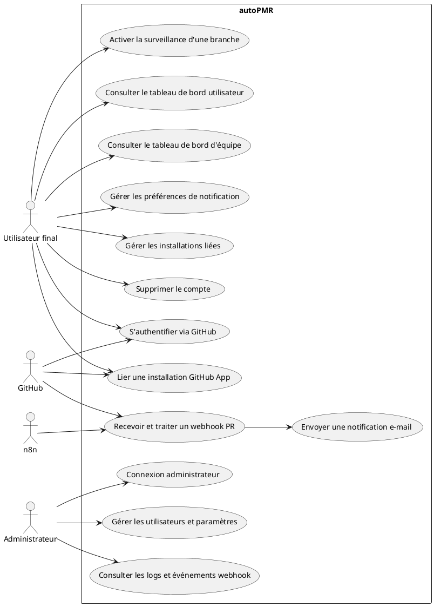
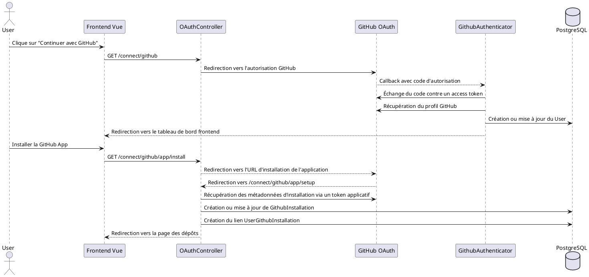
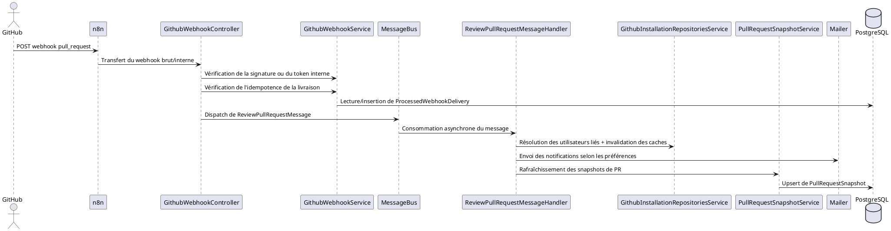
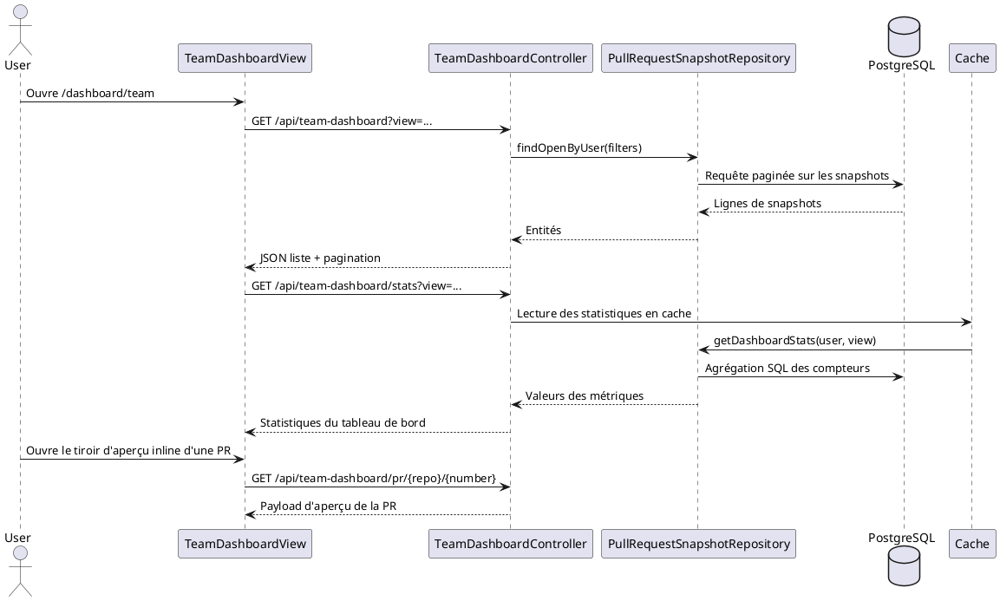
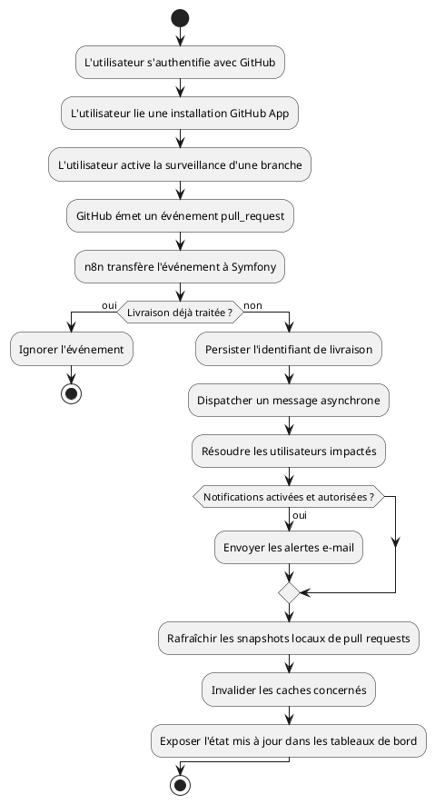
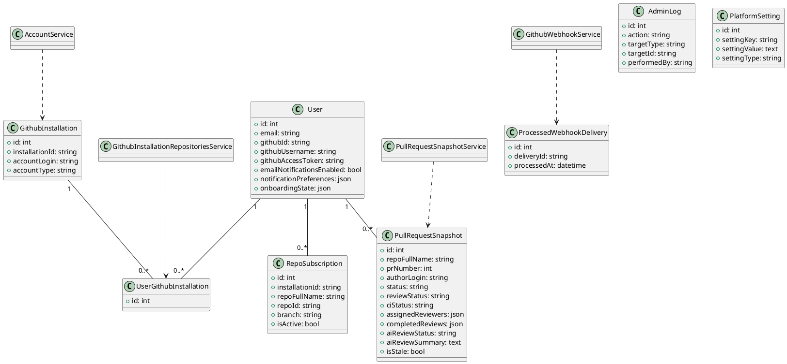
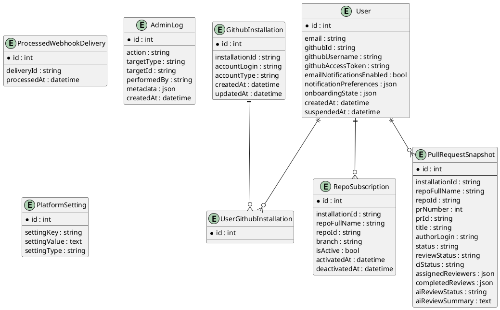

# Documentation PFE - autoPMR

## 1. Introduction

Ce document présente une analyse académique complète du projet `autoPMR`, fondée exclusivement sur le code source inspecté, les fichiers de configuration, les migrations, ainsi que la structure frontend et backend disponibles dans le dépôt.

`autoPMR` est une plateforme de suivi des pull requests GitHub. Son objectif est de connecter un compte utilisateur à GitHub, lier une ou plusieurs installations GitHub App, surveiller les événements liés aux pull requests et aux branches des dépôts, maintenir des snapshots synchronisés des pull requests, puis notifier les utilisateurs par e-mail selon leurs préférences. L'application expose également des tableaux de bord opérationnels pour les utilisateurs finaux et des tableaux de bord d'administration pour la supervision de la plateforme.

La base de code est organisée en trois couches d'exécution principales :

1. Une API backend Symfony 8 dans `api/`
2. Une application monopage Vue 3 dans `frontend/`
3. Un workflow `n8n` utilisé comme couche intermédiaire d'orchestration des webhooks entre GitHub et Symfony

L'environnement Docker inclut aussi PostgreSQL, un worker Messenger, Mailpit, pgAdmin, Prometheus et Grafana.

## 2. Compréhension du projet

### 2.1 Finalité du projet

L'objectif central de la plateforme est de réduire la friction liée au suivi des pull requests. Dans un contexte d'équipe, les pull requests deviennent souvent difficiles à suivre parce que les demandes de revue, les validations, les échecs CI, les discussions obsolètes et les règles de surveillance par dépôt sont dispersés dans les notifications GitHub et à travers plusieurs dépôts. `autoPMR` centralise ces informations et les présente via une couche de tableaux de bord dédiée, tout en envoyant des notifications par e-mail lorsque des événements pertinents surviennent.

### 2.2 Domaine métier

Le domaine métier est celui du support aux workflows d'ingénierie logicielle, plus précisément la supervision des pull requests, la surveillance des dépôts, la visibilité sur les revues de code et la gestion des notifications autour de l'activité GitHub liée aux pull requests.

### 2.3 Fonctionnalités principales identifiées dans le code

Les fonctionnalités suivantes sont directement attestées dans la base de code :

- Authentification GitHub OAuth pour les utilisateurs finaux
- Liaison des installations GitHub App aux comptes utilisateurs
- Gestion des abonnements par utilisateur, dépôt et branche
- Réception et vérification des webhooks GitHub liés aux pull requests
- Traitement idempotent des webhooks à l'aide d'identifiants de livraison persistés
- Traitement asynchrone via Symfony Messenger
- Envoi de notifications par e-mail selon les préférences utilisateur et le périmètre des dépôts
- Tableau de bord utilisateur avec indicateurs sur les dépôts et les pull requests
- Tableau de bord d'équipe avec snapshots de pull requests, vues de responsabilité, activité, filtres et plusieurs modes d'affichage
- Vue détaillée d'une pull request et vue détaillée des dépôts
- Paramètres utilisateur pour les préférences de notification, les installations liées et la suppression du compte
- Authentification administrateur et tableaux de bord d'administration pour les utilisateurs, dépôts, logs, paramètres et événements webhook traités

### 2.4 Utilisateurs cibles

Deux grandes catégories d'utilisateurs sont implémentées :

**Utilisateurs standards**

Il s'agit des développeurs ou parties prenantes des dépôts qui connectent leur compte GitHub, lient une installation GitHub App, activent la surveillance de branches, consultent les tableaux de bord et reçoivent des notifications par e-mail.

**Administrateurs de la plateforme**

Il s'agit des administrateurs internes authentifiés via une interface d'administration dédiée. Ils peuvent inspecter les utilisateurs, les installations, les paramètres, les logs et les informations liées au traitement des webhooks.

### 2.5 Technologies utilisées

Les technologies sont observables dans `composer.json`, `package.json`, la configuration Docker et la structure de l'application :

**Backend**

- PHP `>= 8.4`
- Symfony `8.0`
- Doctrine ORM et Doctrine Migrations
- Symfony Security
- Symfony Mailer
- Symfony Messenger avec traitement asynchrone des messages
- Symfony Cache
- Symfony Rate Limiter
- KnpU OAuth2 Client Bundle
- League OAuth2 GitHub

**Frontend**

- Vue `3.5`
- Vue Router
- TypeScript
- Vite

**Infrastructure et services de support**

- PostgreSQL `16`
- n8n
- Mailpit
- pgAdmin
- Prometheus
- Grafana
- Docker Compose

### 2.6 Architecture globale

À haut niveau, l'architecture est orientée API et pilotée par les événements :

- Le frontend Vue appelle l'API Symfony pour l'état d'authentification, les abonnements, les tableaux de bord, les paramètres et les pages d'administration.
- Les webhooks GitHub sont d'abord envoyés à n8n.
- n8n transfère l'événement à Symfony via un token interne et déclenche aussi un second endpoint interne pour un traitement filtré des pull requests.
- Symfony valide l'authenticité du webhook ou la confiance interne, garantit l'idempotence, puis publie des messages vers le worker asynchrone.
- Le worker Messenger envoie les notifications et rafraîchit les snapshots de pull requests stockés dans PostgreSQL.
- Les tableaux de bord lisent soit des données GitHub mises en cache, soit des snapshots locaux de pull requests selon le cas d'usage.

## 3. Analyse fonctionnelle

### 3.1 Contexte du projet

Les équipes logicielles s'appuient de plus en plus sur les pull requests comme mécanisme central de collaboration pour l'intégration du code. Cependant, les notifications natives de GitHub sont fragmentées et centrées sur le dépôt. Un développeur appartenant à plusieurs dépôts ou organisations peut perdre de la visibilité sur ce qui nécessite une revue, les pull requests bloquées par la CI, les branches surveillées et les dépôts effectivement connectés à la plateforme.

`autoPMR` répond à ce contexte en proposant une couche unifiée de monitoring bâtie autour de l'authentification GitHub, de l'installation de l'application GitHub, des abonnements aux dépôts, de la synchronisation de l'état des pull requests et de notifications configurables.

### 3.2 Problématique

La problématique adressée par l'application peut être formulée ainsi :

Comment centraliser le suivi des pull requests GitHub pour une équipe de développement, tout en préservant le contrôle par utilisateur sur les notifications et les dépôts surveillés, et en garantissant un traitement fiable des événements sans effets de bord dupliqués ni suivi manuel excessif ?

Cette problématique est visible dans plusieurs choix architecturaux présents dans le code :

- idempotence persistée des livraisons webhook
- traitement asynchrone via Messenger
- activation des abonnements par utilisateur, dépôt et branche
- lectures GitHub mises en cache et stockage local des snapshots pour la consultation des tableaux de bord
- filtrage des notifications par type d'événement et par périmètre de dépôt

### 3.3 Objectifs

Les principaux objectifs implémentés par le projet sont les suivants :

1. Authentifier un utilisateur via GitHub et associer le compte plateforme à une identité GitHub.
2. Lier des installations GitHub App afin que la plateforme puisse accéder aux dépôts appartenant à l'utilisateur ou à son organisation.
3. Permettre à l'utilisateur d'activer la surveillance de branches pour des dépôts sélectionnés.
4. Recevoir les événements pull request provenant de GitHub de manière fiable et idempotente.
5. Notifier les utilisateurs concernés par e-mail selon des règles de préférence explicites.
6. Fournir un tableau de bord pour le suivi des dépôts et des pull requests.
7. Fournir une interface d'administration pour la supervision et la maintenance.

### 3.4 Acteurs

Les principaux acteurs identifiés dans le code sont :

**Utilisateur final**

L'utilisateur final souhaite surveiller des dépôts, recevoir des notifications pertinentes sur les pull requests, inspecter l'activité des dépôts et suivre le travail à travers les interfaces de tableaux de bord.

**Administrateur**

L'administrateur pilote la plateforme depuis l'interface d'administration, supervise les utilisateurs et les installations, modifie les paramètres et consulte les logs ainsi que les événements webhook traités.

**GitHub**

GitHub agit comme fournisseur d'identité externe, fournisseur de dépôts et source d'événements via OAuth, les installations GitHub App, les appels à l'API REST et les webhooks.

**n8n**

`n8n` agit comme couche d'orchestration pour les webhooks GitHub entrants, en transférant des charges utiles brutes et filtrées vers Symfony.

**Infrastructure mail**

Le transport SMTP et Mailpit supportent le mécanisme de notification.

### 3.5 Besoins fonctionnels

Les besoins fonctionnels suivants sont directement couverts par l'application :

| ID | Besoin fonctionnel |
| --- | --- |
| FR1 | Le système doit permettre la connexion via GitHub OAuth. |
| FR2 | Le système doit lier une installation GitHub App à l'utilisateur authentifié. |
| FR3 | L'utilisateur doit pouvoir consulter les dépôts disponibles via les installations liées. |
| FR4 | L'utilisateur doit pouvoir activer ou désactiver la surveillance d'une branche de dépôt. |
| FR5 | Le système doit recevoir les webhooks GitHub liés aux pull requests. |
| FR6 | Le système doit éviter de traiter plusieurs fois une même livraison webhook. |
| FR7 | Le système doit envoyer des notifications par e-mail selon les préférences utilisateur. |
| FR8 | Le système doit fournir un tableau de bord utilisateur avec des indicateurs sur les dépôts et les pull requests. |
| FR9 | Le système doit fournir un tableau de bord d'équipe avec liste des pull requests, filtres, métriques et aperçu détaillé. |
| FR10 | L'utilisateur doit pouvoir gérer ses paramètres de notification et ses installations liées. |
| FR11 | L'administrateur doit pouvoir s'authentifier séparément des utilisateurs finaux. |
| FR12 | L'administrateur doit pouvoir consulter les utilisateurs, les installations, les paramètres, les événements traités et les logs. |

### 3.6 Besoins non fonctionnels

Les besoins non fonctionnels déduits de l'implémentation sont les suivants.

**Performance**

L'application utilise Symfony Cache pour réduire les appels répétés à l'API GitHub concernant les dépôts, branches, pull requests, insights de dépôt, données de tableau de bord et statistiques du team dashboard. Le team dashboard s'appuie également sur une table locale de snapshots afin d'éviter de reconstruire tout l'état directement depuis GitHub à chaque requête.

**Scalabilité**

Les effets de bord liés aux webhooks sont déportés vers des workers Symfony Messenger. Il s'agit d'un choix fort de scalabilité, car l'envoi d'e-mails et le rafraîchissement des snapshots de pull requests ne sont pas exécutés de manière synchrone dans le contrôleur.

**Fiabilité**

La table `ProcessedWebhookDelivery` garantit le traitement idempotent des livraisons GitHub. Cela réduit le risque de notifications dupliquées et de traitements aval redondants.

**Sécurité**

Le projet utilise GitHub OAuth, l'authentification GitHub App, la vérification de signature des webhooks, la vérification d'un token interne pour les appels n8n vers Symfony, une sécurité utilisateur basée sur la session et une authentification administrateur basée sur JWT.

**Maintenabilité**

La base de code suit une séparation relativement claire entre contrôleurs, services, repositories, handlers de messages et clients API frontend. Cela améliore la maintenabilité et facilite les évolutions futures.

### 3.7 Règles de gestion

Les règles de gestion suivantes sont explicitement visibles dans le code :

1. Une livraison webhook identifiée par `X-GitHub-Delivery` ne doit pas être traitée plus d'une fois.
2. Les notifications ne concernent que les utilisateurs liés à l'installation GitHub ayant émis l'événement.
3. L'envoi des notifications doit respecter `emailNotificationsEnabled`.
4. L'envoi des notifications doit respecter la structure de préférences utilisateur composée des préférences d'événements et des filtres de dépôts.
5. La surveillance des branches repose sur des abonnements. Seuls les abonnements actifs sont pris en compte dans la logique de suivi des dépôts.
6. Les snapshots de pull requests sont stockés par utilisateur. Une même pull request GitHub peut donc apparaître dans plusieurs snapshots spécifiques à des utilisateurs selon les installations liées et les abonnements.
7. La fermeture ou la suspension d'une installation doit désactiver les abonnements associés et invalider les clés de cache concernées.
8. Les traitements coûteux doivent être réalisés de manière asynchrone via les handlers Messenger plutôt que dans les contrôleurs HTTP.

### 3.8 Cas d'utilisation

#### UC1 - S'authentifier avec GitHub

L'utilisateur démarre le processus OAuth depuis l'interface de connexion. GitHub authentifie l'utilisateur puis le redirige vers Symfony. Le backend récupère le profil GitHub, crée ou met à jour l'utilisateur local, stocke le token d'accès et redirige l'utilisateur vers le tableau de bord frontend.

#### UC2 - Installer ou lier l'application GitHub

Après authentification, l'utilisateur est redirigé vers la page d'installation de la GitHub App. Une fois l'installation terminée, GitHub redirige vers le callback de configuration. Le backend crée ou met à jour une `GithubInstallation`, la lie à l'utilisateur via `UserGithubInstallation`, complète l'étape d'onboarding correspondante et invalide les caches concernés.

#### UC3 - Activer la surveillance d'une branche de dépôt

L'utilisateur consulte la liste des dépôts, sélectionne un dépôt et active la surveillance d'une ou plusieurs branches. Le système persiste un `RepoSubscription` et marque comme complétée l'étape d'onboarding liée à l'activation de branche.

#### UC4 - Recevoir des notifications de pull request

Lorsqu'un événement pull request est émis par GitHub, n8n le transfère à Symfony. Symfony valide la requête, vérifie l'idempotence et publie des messages asynchrones. Le worker détermine les utilisateurs concernés, les filtre via leurs préférences de notification et leurs abonnements, envoie les e-mails puis rafraîchit les snapshots.

#### UC5 - Consulter le tableau de bord utilisateur

L'utilisateur ouvre le tableau de bord principal et obtient des KPI synthétiques sur le nombre de dépôts, le nombre de pull requests, les pull requests récentes et les principaux dépôts. Ce tableau de bord s'appuie principalement sur des lectures GitHub mises en cache.

#### UC6 - Consulter le tableau de bord d'équipe

L'utilisateur ouvre le tableau de bord d'équipe afin d'analyser des snapshots locaux synchronisés de pull requests. L'interface supporte plusieurs vues de responsabilité telles que les PRs rédigées par l'utilisateur, celles qui demandent sa revue, celles qu'il a approuvées, celles bloquées par la CI et celles sans propriétaire. Elle fournit aussi des filtres, des données d'activité et un tiroir d'aperçu inline de la pull request.

#### UC7 - Gérer les préférences de notification

L'utilisateur active ou désactive globalement les notifications e-mail, configure les types d'événements pull request qui déclenchent des alertes, et peut restreindre les notifications à une liste spécifique de dépôts.

#### UC8 - Administrer la plateforme

Un administrateur se connecte via l'interface d'administration avec des identifiants dédiés, puis inspecte les utilisateurs, les dépôts, les événements webhook, les paramètres et les logs. Il peut suspendre des utilisateurs, supprimer des utilisateurs, déconnecter des installations et vider l'historique des livraisons webhook.

## 4. UML et conception

### 4.1 Diagramme de cas d'utilisation

Interprétation textuelle :

- L'utilisateur final s'authentifie avec GitHub.
- L'utilisateur final lie une installation GitHub App.
- L'utilisateur final gère ses abonnements aux dépôts.
- L'utilisateur final consulte les tableaux de bord et le détail des pull requests.
- L'utilisateur final configure ses notifications et les paramètres de son compte.
- L'administrateur gère les utilisateurs, les paramètres, les logs et les installations.
- GitHub envoie les réponses OAuth, les données API et les webhooks.
- n8n transfère les événements webhook vers les endpoints internes.



### 4.2 Diagramme de séquence - OAuth et liaison d'installation



### 4.3 Diagramme de séquence - Traitement webhook et notification



### 4.4 Diagramme de séquence - Consultation du Team Dashboard



### 4.5 Diagramme d'activité - Processus principal



### 4.6 Diagramme de classes

Le diagramme suivant modélise les éléments structurels les plus importants, sans représenter toutes les classes du dépôt.



## 5. Conception de la base de données (MCD / MLD)

### 5.1 Entités extraites

Les entités persistantes suivantes sont définies dans le backend :

- `User`
- `GithubInstallation`
- `UserGithubInstallation`
- `RepoSubscription`
- `PullRequestSnapshot`
- `ProcessedWebhookDelivery`
- `AdminLog`
- `PlatformSetting`

### 5.2 MCD - Modèle conceptuel de données

Au niveau conceptuel, le système s'articule autour de l'utilisateur comme acteur central. Un utilisateur peut être lié à plusieurs installations GitHub App via une entité d'association, peut activer plusieurs abonnements à des dépôts, et possède plusieurs snapshots de pull requests. Les actions administratives et les paramètres sont modélisés séparément.

**Relations principales**

- Un `User` peut être lié à zéro ou plusieurs enregistrements `GithubInstallation`.
- Une `GithubInstallation` peut être liée à zéro ou plusieurs `User`.
- Cette relation plusieurs-à-plusieurs est matérialisée par `UserGithubInstallation`.
- Un `User` peut posséder zéro ou plusieurs `RepoSubscription`.
- Un `User` peut posséder zéro ou plusieurs `PullRequestSnapshot`.
- `ProcessedWebhookDelivery` est une entité indépendante qui stocke les identifiants uniques de livraisons déjà traitées.
- `AdminLog` stocke les traces des actions administrateur.
- `PlatformSetting` stocke des paramètres configurables au niveau de la plateforme.

### 5.3 Diagramme MCD (PlantUML style ER)



### 5.4 MLD - Modèle logique de données

Le modèle logique peut être exprimé sous la forme relationnelle suivante :

```text
USER(
  id PK,
  email UNIQUE,
  roles,
  password,
  github_id UNIQUE,
  github_username,
  github_access_token,
  email_notifications_enabled,
  unsubscribe_token UNIQUE,
  notification_preferences JSON,
  onboarding_state JSON,
  created_at,
  suspended_at
)

GITHUB_INSTALLATION(
  id PK,
  installation_id UNIQUE,
  account_login,
  account_type,
  created_at,
  updated_at
)

USER_GITHUB_INSTALLATION(
  id PK,
  app_user_id FK -> USER.id,
  installation_id FK -> GITHUB_INSTALLATION.id
)

REPO_SUBSCRIPTION(
  id PK,
  app_user_id FK -> USER.id,
  installation_id,
  repo_full_name,
  repo_id,
  branch,
  is_active,
  activated_at,
  deactivated_at,
  created_at,
  updated_at,
  UNIQUE(app_user_id, repo_full_name, branch)
)

PULL_REQUEST_SNAPSHOT(
  id PK,
  app_user_id FK -> USER.id,
  installation_id,
  repo_full_name,
  repo_id,
  pr_number,
  pr_id,
  title,
  description,
  author_login,
  author_avatar_url,
  source_branch,
  target_branch,
  status,
  review_status,
  ci_status,
  comment_count,
  changed_files,
  additions,
  deletions,
  assigned_reviewers JSON,
  completed_reviews JSON,
  labels JSON,
  ai_review_status,
  ai_review_summary,
  ai_issue_count,
  github_url,
  is_draft,
  is_stale,
  staleness_threshold_days,
  opened_at,
  last_activity_at,
  snapshot_updated_at,
  created_at
)

PROCESSED_WEBHOOK_DELIVERY(
  id PK,
  delivery_id UNIQUE,
  processed_at
)

ADMIN_LOG(
  id PK,
  action,
  target_type,
  target_id,
  performed_by,
  metadata JSON,
  created_at
)

PLATFORM_SETTING(
  id PK,
  setting_key UNIQUE,
  setting_value,
  setting_type
)
```

### 5.5 Cardinalités

- Un `User` vers plusieurs `RepoSubscription`
- Un `User` vers plusieurs `PullRequestSnapshot`
- Plusieurs `User` vers plusieurs `GithubInstallation` via `UserGithubInstallation`
- Une `GithubInstallation` vers plusieurs `UserGithubInstallation`
- `ProcessedWebhookDelivery`, `AdminLog` et `PlatformSetting` sont des entités autonomes

### 5.6 Schéma SQL (simplifié)

Le dépôt contient des migrations Doctrine et non un schéma SQL manuscrit unique. Le SQL simplifié suivant est fidèle à la structure persistée réelle, même si tous les index et toutes les contraintes n'y sont pas reproduits :

```sql
CREATE TABLE "user" (
  id SERIAL PRIMARY KEY,
  email VARCHAR(180) NOT NULL UNIQUE,
  roles JSON NOT NULL,
  password VARCHAR(255) NOT NULL,
  github_id VARCHAR(255) DEFAULT NULL UNIQUE,
  github_username VARCHAR(255) DEFAULT NULL,
  github_access_token TEXT DEFAULT NULL,
  email_notifications_enabled BOOLEAN NOT NULL DEFAULT TRUE,
  unsubscribe_token VARCHAR(64) DEFAULT NULL UNIQUE,
  notification_preferences JSON DEFAULT NULL,
  onboarding_state JSON DEFAULT NULL,
  created_at TIMESTAMP DEFAULT NULL,
  suspended_at TIMESTAMP DEFAULT NULL
);

CREATE TABLE github_installation (
  id SERIAL PRIMARY KEY,
  installation_id VARCHAR(255) NOT NULL UNIQUE,
  account_login VARCHAR(255) DEFAULT NULL,
  account_type VARCHAR(64) DEFAULT NULL,
  created_at TIMESTAMP NOT NULL,
  updated_at TIMESTAMP NOT NULL
);

CREATE TABLE user_github_installation (
  id SERIAL PRIMARY KEY,
  app_user_id INT NOT NULL REFERENCES "user"(id) ON DELETE CASCADE,
  installation_id INT NOT NULL REFERENCES github_installation(id) ON DELETE CASCADE
);

CREATE TABLE repo_subscription (
  id SERIAL PRIMARY KEY,
  app_user_id INT NOT NULL REFERENCES "user"(id) ON DELETE CASCADE,
  installation_id VARCHAR(255) NOT NULL,
  repo_full_name VARCHAR(255) NOT NULL,
  repo_id VARCHAR(255) NOT NULL,
  branch VARCHAR(255) NOT NULL,
  is_active BOOLEAN NOT NULL DEFAULT TRUE,
  activated_at TIMESTAMP DEFAULT NULL,
  deactivated_at TIMESTAMP DEFAULT NULL,
  created_at TIMESTAMP NOT NULL,
  updated_at TIMESTAMP NOT NULL,
  UNIQUE(app_user_id, repo_full_name, branch)
);

CREATE TABLE pull_request_snapshot (
  id SERIAL PRIMARY KEY,
  app_user_id INT NOT NULL REFERENCES "user"(id) ON DELETE CASCADE,
  installation_id VARCHAR(255) NOT NULL,
  repo_full_name VARCHAR(255) NOT NULL,
  repo_id VARCHAR(255) NOT NULL,
  pr_number INT NOT NULL,
  pr_id VARCHAR(255) NOT NULL,
  title VARCHAR(255) NOT NULL,
  description TEXT DEFAULT NULL,
  author_login VARCHAR(255) NOT NULL,
  status VARCHAR(32) NOT NULL,
  review_status VARCHAR(32) NOT NULL,
  ci_status VARCHAR(32) NOT NULL,
  assigned_reviewers JSON NOT NULL,
  completed_reviews JSON NOT NULL,
  labels JSON NOT NULL
);

CREATE TABLE processed_webhook_delivery (
  id SERIAL PRIMARY KEY,
  delivery_id VARCHAR(255) NOT NULL UNIQUE,
  processed_at TIMESTAMP NOT NULL
);

CREATE TABLE admin_log (
  id SERIAL PRIMARY KEY,
  action VARCHAR(255) NOT NULL,
  target_type VARCHAR(255) DEFAULT NULL,
  target_id VARCHAR(255) DEFAULT NULL,
  performed_by VARCHAR(255) NOT NULL,
  metadata JSON DEFAULT NULL,
  created_at TIMESTAMP NOT NULL
);

CREATE TABLE platform_setting (
  id SERIAL PRIMARY KEY,
  setting_key VARCHAR(255) NOT NULL UNIQUE,
  setting_value TEXT DEFAULT NULL,
  setting_type VARCHAR(64) NOT NULL
);
```

## 6. Analyse technique

### 6.1 Architecture du système

Le système suit une architecture en couches orientée API, avec des caractéristiques MVC côté backend et une architecture SPA côté frontend.

**Style backend**

Le backend Symfony utilise des contrôleurs pour l'exposition HTTP, des repositories pour l'accès aux données, des services pour la logique métier et d'intégration, et des handlers Messenger pour les opérations asynchrones. Cette séparation est cohérente avec une structure d'application d'entreprise maintenable.

**Style frontend**

Le frontend Vue est une SPA côté client structurée autour des routes, des vues, des modules API et des composants UI réutilisables.

**Comportement orienté événements**

Le traitement des webhooks et l'envoi des notifications sont pilotés par les événements car les principaux effets de bord sont délégués à des handlers asynchrones.

### 6.2 Structure du backend

Le backend contient les zones logiques suivantes :

- `Controller/` pour les endpoints HTTP
- `Entity/` pour les entités Doctrine
- `Repository/` pour la logique de requêtage
- `Security/` pour OAuth et l'authentification administrateur
- `Service/` pour l'accès à GitHub, la centralisation des clés de cache et la logique métier
- `Message/` et `MessageHandler/` pour les commandes asynchrones
- `Migrations/` pour l'évolution du schéma

Responsabilités backend importantes :

- `GithubAuthenticator` et `OAuthController` gèrent l'authentification utilisateur et la liaison des installations.
- `GithubWebhookController` et `GithubWebhookService` implémentent la vérification des webhooks et l'idempotence.
- `ReviewPullRequestMessageHandler` prend en charge le flux principal de notification.
- `PullRequestSnapshotService` synchronise les snapshots de pull requests.
- `DashboardController` et `TeamDashboardController` exposent les données de monitoring au frontend.

### 6.3 Structure du frontend

Le frontend est organisé autour de :

- `src/router/` pour la navigation et les guards
- `src/views/` pour les écrans de niveau page
- `src/api/` pour la communication avec le backend
- `src/components/` pour l'UI réutilisable
- `src/types/` pour les modèles frontend

Vues importantes identifiées :

- `LandingView`
- `LoginView`
- `DashboardView`
- `TeamDashboardView`
- `RepositoriesView`
- `RepositoryDetailsView`
- `PrDetailsView`
- `SettingsView`
- `UnsubscribeView`
- les vues admin pour le tableau de bord, les utilisateurs, les dépôts, les notifications, les logs, les paramètres et l'historique des événements de pull requests

### 6.4 Flux de données

L'application utilise deux principaux flux de données.

**Flux A - Consultation à la demande des dépôts**

1. Le frontend demande les dépôts, branches, pull requests ou insights.
2. Symfony utilise un token d'installation GitHub App pour appeler l'API GitHub.
3. Les résultats sont mis en cache pour de courtes durées.
4. Le backend renvoie un JSON normalisé au frontend.

**Flux B - Synchronisation pilotée par événements des pull requests**

1. GitHub émet un webhook pull request.
2. n8n reçoit puis transfère la charge utile en interne.
3. Symfony valide l'authenticité ou l'autorisation interne.
4. La livraison webhook est vérifiée dans `ProcessedWebhookDelivery`.
5. Un message Messenger est publié.
6. Le worker résout les utilisateurs concernés et le périmètre des abonnements.
7. Les notifications e-mail sont envoyées si elles sont autorisées.
8. Les snapshots de pull requests sont rafraîchis et stockés dans PostgreSQL.
9. Le team dashboard lit cet état local synchronisé.

### 6.5 Intégrations

La base de code inspectée contient les intégrations suivantes :

**GitHub OAuth**

Utilisé pour l'authentification des utilisateurs finaux et la récupération du profil GitHub.

**GitHub App**

Utilisé pour accéder aux données des dépôts et aux métadonnées d'installation via des tokens d'installation.

**API REST GitHub**

Utilisée pour récupérer les dépôts, branches, pull requests, reviews, reviewers demandés, statuts CI, fichiers modifiés, commits, contributeurs et détails de dépôt.

**n8n**

Utilisé comme orchestrateur de webhooks. Le workflow transfère le webhook GitHub original vers Symfony et envoie aussi un événement interne filtré pour le traitement des pull requests.

**Mailer / SMTP**

Utilisé pour les notifications e-mail de pull request et la gestion du désabonnement.

**Prometheus et Grafana**

Ces services sont présents dans le déploiement. Toutefois, le code applicatif inspecté ne montre pas une instrumentation métier profonde en métriques, ce qui suggère un usage principalement infrastructural plutôt qu'étroitement intégré à la logique métier.

### 6.6 Mécanismes de sécurité

Plusieurs mécanismes de sécurité sont explicitement implémentés :

- GitHub OAuth pour l'identité utilisateur
- authentification utilisateur basée sur la session Symfony
- authentification administrateur dédiée avec JWT
- vérification HMAC de la signature des webhooks GitHub
- vérification d'un token interne pour les requêtes transférées par n8n
- séparation des rôles entre utilisateurs standards et administrateurs
- rate limiting sur certains endpoints, notamment les webhooks et les tableaux de bord

Certaines limites sont également visibles dans l'implémentation actuelle :

- Le compte administrateur repose sur des variables d'environnement plutôt que sur une table dédiée en base.
- Certains secrets apparaissent dans `docker-compose.yml`, ce qui est acceptable en développement local mais pas en production.

### 6.7 Considérations de performance

La performance a été traitée à travers plusieurs mécanismes :

- mise en cache des données GitHub et des tableaux de bord
- agrégations SQL pour les statistiques du team dashboard
- récupération paginée pour les listes du team dashboard
- traitement asynchrone des effets de bord liés aux webhooks
- stockage local des snapshots de pull requests afin d'éviter de reconstruire entièrement l'état du tableau de bord depuis GitHub à chaque requête

La base de code révèle aussi des points de vigilance à surveiller à l'avenir :

- appels GitHub répétés lors de rafraîchissements de snapshots à grande échelle
- duplication des données de snapshots par utilisateur
- comportements de polling sur certaines pages de dashboard

## 7. Analyse du flux de données et du pipeline

### 7.1 Clarification concernant la BI / l'ETL

Ce dépôt n'est pas un projet de Business Intelligence au sens classique. Le code inspecté ne contient pas :

- d'intégration Power BI
- de stockage orienté Excel
- de schéma de data warehouse
- de jobs ETL batch pour le reporting analytique
- de cubes OLAP ou de couche décisionnelle classique

Par conséquent, rédiger un chapitre ETL orienté BI de manière classique serait inexact pour ce projet.

### 7.2 Pipeline opérationnel réellement présent dans le code

Le projet contient néanmoins un pipeline opérationnel de traitement d'événements :

1. **Source de données** : GitHub OAuth, APIs GitHub App et événements webhook GitHub
2. **Transport / orchestration** : workflow n8n qui transfère des requêtes internes
3. **Transformation** : les services Symfony normalisent les payloads GitHub vers des structures orientées utilisateur et orientées dashboard
4. **Stockage** :
   - PostgreSQL pour l'état persistant de l'application
   - `PullRequestSnapshot` pour les données synchronisées de monitoring
   - cache pour les données de dépôts et de tableaux de bord à courte durée de vie
5. **Sortie** :
   - tableaux de bord Vue et vues détaillées
   - notifications e-mail
   - pages d'administration

### 7.3 Logique de transformation

Exemples de transformations visibles dans le code :

- les données brutes de pull request GitHub sont converties en `PullRequestSnapshot`
- les demandes de review et les reviews complétées sont normalisées dans des tableaux JSON
- l'état CI est converti en champs de statut compacts pour le dashboard
- les statistiques des tableaux de bord sont agrégées via des requêtes SQL
- les préférences de notification transforment des événements webhook génériques en décisions utilisateur spécifiques de type envoi ou ignore

## 8. Analyse critique

### 8.1 Forces

Le projet présente plusieurs décisions de conception solides.

Premièrement, la séparation entre les contrôleurs HTTP synchrones et les handlers Messenger asynchrones est adaptée aux applications fortement alimentées par des webhooks. Elle réduit la latence et maintient des contrôleurs fins.

Deuxièmement, le traitement idempotent des webhooks via `ProcessedWebhookDelivery` constitue un mécanisme fort de correction fonctionnelle. C'est particulièrement important dans les systèmes d'intégration où les retries sont fréquents.

Troisièmement, la distinction entre les lectures GitHub à la demande mises en cache et le monitoring fondé sur des snapshots locaux persistés est bien alignée avec les besoins du produit. Les pages de détail des dépôts peuvent rester proches de GitHub, tandis que le team dashboard bénéficie d'une structure locale facilement interrogeable.

Quatrièmement, le projet intègre déjà des préoccupations opérationnelles telles que la supervision administrateur, la gestion des paramètres, la logique de désabonnement et l'invalidation des caches, ce qui traduit une logique de plateforme plus qu'un simple prototype de dashboard.

### 8.2 Faiblesses

Certaines faiblesses sont également visibles.

Le pipeline d'analyse IA est actuellement partiellement implémenté. Le modèle de données stocke déjà les champs `aiReviewStatus` et `aiReviewSummary`, et n8n transfère des payloads filtrés de pull requests vers un endpoint interne, mais `ProcessPullRequestHandler` se contente actuellement de logger les données au lieu d'exécuter un véritable workflow d'analyse IA.

Le modèle de snapshots de pull requests est conçu par utilisateur plutôt que sous une forme globalement normalisée. Cela simplifie les dashboards personnalisés mais duplique les données et peut devenir coûteux lorsque le nombre d'utilisateurs et de dépôts surveillés augmente.

Le modèle d'authentification administrateur est simple et piloté par l'environnement. Il est fonctionnel dans un cadre contrôlé mais reste limité pour un niveau entreprise, la gestion multi-administrateur ou une gouvernance plus fine.

La configuration TypeScript du frontend contient encore des erreurs de typecheck sans impact direct sur le métier, ce qui révèle une dette technique sur le typage frontend et les déclarations de modules.

### 8.3 Risques

Les principaux risques sont :

- limitation de taux de l'API GitHub si les rafraîchissements de dépôts et de snapshots montent en charge
- croissance des données dupliquées de snapshots sur de nombreux utilisateurs
- fatigue liée aux notifications si les préférences par défaut ne sont pas suffisamment maîtrisées
- dépendance opérationnelle à n8n comme composant supplémentaire dans la chaîne des webhooks
- risque de production si les secrets de développement ne sont pas correctement externalisés

### 8.4 Limites

Les limites suivantes sont directement confirmées par l'inspection du code :

- Les notifications sont uniquement basées sur l'e-mail.
- L'historique détaillé des notifications n'est pas persisté comme un journal métier dédié.
- Les événements détaillés de pull requests ne sont pas stockés comme un event store riche.
- Le pipeline IA est incomplet.
- Il n'existe pas d'indice de support mobile natif ni de mode hors ligne.
- La stack d'observabilité est présente dans le déploiement, mais l'instrumentation applicative métier visible reste limitée.

## 9. Améliorations et travaux futurs

### 9.1 Améliorations techniques

Plusieurs améliorations techniques prolongeraient logiquement l'architecture actuelle :

1. Introduire une table centrale normalisée de pull requests partagée entre utilisateurs, complétée par des tables de surcouche spécifiques à l'utilisateur pour la responsabilité et les préférences, afin de réduire la duplication des données.
2. Ajouter une couverture de tests automatisés plus forte sur les flux webhook, les handlers Messenger et les requêtes des dashboards.
3. Remplacer les identifiants administrateur purement définis par l'environnement par des administrateurs persistés et une autorisation fondée sur des rôles.
4. Améliorer le typage TypeScript frontend et les déclarations de modules afin de rendre le typecheck exploitable comme garde-fou CI.
5. Ajouter des journaux d'audit plus riches pour les notifications envoyées et des capacités de replay de webhook.

### 9.2 Améliorations de scalabilité

Pour la scalabilité, les pistes suivantes sont cohérentes avec le système actuel :

1. Introduire un rafraîchissement incrémental des snapshots plutôt que des scans larges de dépôts lorsque c'est possible.
2. Ajouter un partitionnement des files ou des transports dédiés pour les jobs de rafraîchissement lourds.
3. Mettre davantage en cache les tokens d'installation GitHub App et les agrégats coûteux dérivés de l'API.
4. Ajouter des jobs de réconciliation en arrière-plan pour corriger les dérives entre l'état GitHub et les snapshots locaux.

### 9.3 Opportunités d'automatisation

Le projet intègre déjà n8n, ce qui ouvre plusieurs possibilités d'automatisation :

1. escalade automatique des pull requests obsolètes
2. e-mails digest planifiés
3. rappels automatiques aux reviewers en attente
4. workflows de replay webhook et de remédiation

### 9.4 Idées d'intégration IA

Le code anticipe déjà une intégration IA via `aiReviewStatus`, `aiReviewSummary` et l'endpoint interne de traitement de pull request. Les prochaines étapes réalistes seraient :

1. générer des résumés structurés de pull requests
2. mettre en évidence les zones de risque à partir des diffs de fichiers et de l'historique des commits
3. classifier les échecs CI et les goulets d'étranglement de revue récurrents
4. proposer des reviewers en fonction des fichiers modifiés et des contributions passées

Ces idées sont cohérentes avec le schéma actuel et les frontières de services existantes, car le modèle de snapshot contient déjà des champs prévus pour un enrichissement par IA.

## 10. Conclusion

`autoPMR` est une plateforme cohérente de monitoring des pull requests, située à l'intersection de l'hébergement de code, de l'automatisation de workflows et des outils de productivité pour développeurs. La base de code montre une volonté claire de construire un produit opérationnel fiable plutôt qu'un simple prototype de dashboard. Ses choix architecturaux les plus solides sont l'idempotence des webhooks, le traitement asynchrone, l'usage de caches à courte durée de vie et l'introduction d'un modèle local de snapshots pour la consultation du tableau de bord d'équipe.

D'un point de vue PFE, le projet est techniquement pertinent car il combine ingénierie web, intégration d'API, traitement asynchrone, modélisation de données, logique de notification et synthèse d'informations orientée dashboard. L'implémentation actuelle délivre déjà une plateforme fonctionnelle de monitoring de pull requests GitHub tout en laissant une marge d'évolution sur l'analyse IA, la profondeur d'observabilité et l'affinement de la scalabilité.

## 11. Notes de périmètre et éléments manquants

Pour rester fidèle au code, les points suivants doivent être explicitement mentionnés :

- Aucun pipeline BI classique ni module Power BI n'est implémenté dans ce dépôt.
- Le workflow d'analyse IA est préparé structurellement mais n'est pas entièrement implémenté.
- La persistance des notifications est limitée ; le code stocke surtout les préférences plutôt qu'un journal complet des notifications.
- Prometheus et Grafana sont disponibles dans le déploiement, mais une instrumentation applicative profonde n'est pas fortement visible dans le code inspecté.

